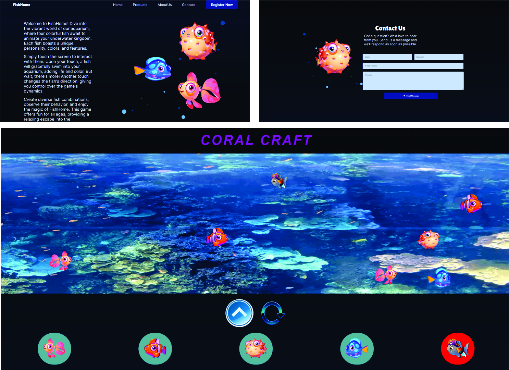

# AquariumCompany
This projec is about aquarium company.

It includes interesting aquarium game, which players are simple fishes and a "bad" shark, which eats them.
When shark eats, it becomes larger.

There is alse a part of contact for makeing different suggestions to us.

# 

## To run this application, you'll need the following software installed on your system:

**Node.js and npm:** These are essential for managing JavaScript dependencies in the project. You can download and install them from the official Node.js website: https://nodejs.org/

## To run this application follow these steps

1. **Clone this repository:**
   git clone [https://github.com/TovmasPetrosyan/AquariumCompany.git]

2. **Navigate to the project directory:**
    cd AquariumCompany

3. **Install dependencies:**
    npm install

